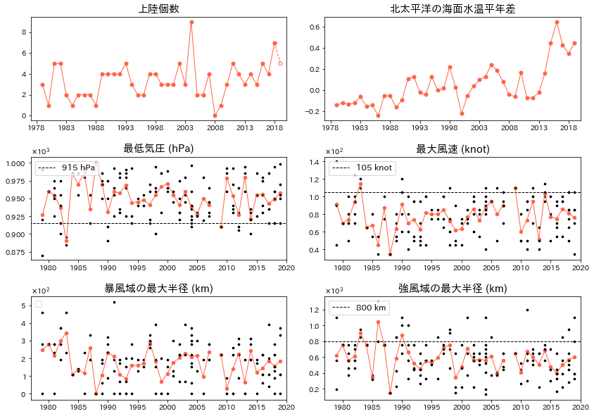
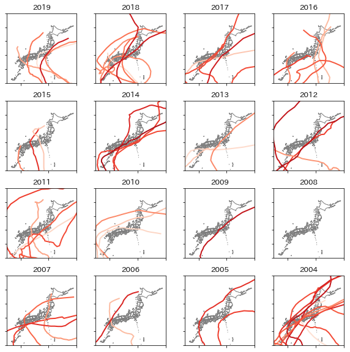

# typhoon_analysis
### 北西太平洋区域における台風のデータ解析
by konkon  
  
1978〜2019の間に北西太平洋区域で発生した台風のデータを解析します。  
台風のデータは以下のサイトから取得します。Typhoon_scraping⇒Typhoon_analysisの順に実行してください。  

[デジタル台風：台風画像と台風情報 - 北本 朝展 @ 国立情報学研究所(NII)](http://agora.ex.nii.ac.jp/digital-typhoon/year/)

また、海面水温平年差のデータ(/typhoon/npac.txt)は以下のサイトから取得しました。  

[北太平洋の海面水温平年差の推移 - 気象庁](https://www.data.jma.go.jp/gmd/kaiyou/data/db/climate/glb_warm/npac_trend.html)

解析結果の例は下の通りです。  

1978~2019年の間に日本に到達した台風の個数, 最低気圧, 最大風速, 暴風/強風域の最大半径, および同期間における北太平洋地域の海面水温。  

2019年~2004の間に日本に到達した台風の経路。色は台風の最低気圧であり、赤色が強いほど気圧が低い(勢力が強い)ことを表す。  
